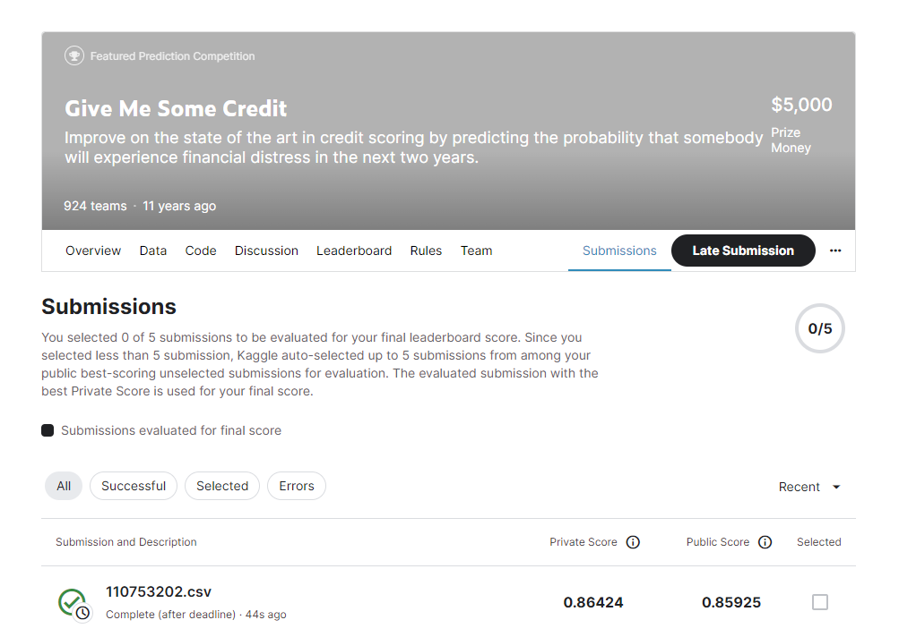

# hw5. GiveMeSomeCredit
#### Name: your name
#### ID: Student ID
#### Snapshot:


## Description
Start here! Predict the probability that somebody will experience financial distress in the next two years (column=SeriousDlqin2yrs).

[GiveMeSomeCredit](https://www.kaggle.com/c/GiveMeSomeCredit/overview)

[code for reference](
https://www.kaggle.com/code/rionelslovesky/predicting-creditworthiness-a-glassbox-attempt)

### Steps
1. You could try different models, parameter and data processing methods.
2. Use the best model to make final predictions on test dataset,  and output to `studentID.csv` 
   
```R
GiveMeSomeCredit("Data/train.csv", "Data/test.csv", "studentID.csv")
```

3. Submit `studentID.csv` to Kaggle system.
4. Make a snapshot of your submissions and update in your README.md.  Like the example above.
5. Upload your code `hw5.R` to Gradescope and GitHub.

## Score
### Private score on kaggle
- 0.86 ~ : 100 points
- 0.80 ~ 0.86: 95 points
- 0.70 ~ 0.80: 90 points
- 0.60 ~ 0.70: 85 points

_base on your best score round down second decimal place. (ex. 0.84724 -> 0.84)_

### Penalty
- -20 points: The results uploaded by the TA do not match the snapshot.

## Note
- Please use R version 4
- execution time: 30 minute maximum
- Filename format of your code: `hw5.R`
- TA will check your code to ensure the final `studentID.csv` is produced by your code and uploaded to Kaggle for verification.
- `sampleEntry.csv` for reference only,  cannot be used directly or indirectly.
- If you cheat, you'll get zero for this assignment, and there's no chance to make up for it. 😠

## References
Please list the code and its reference, i.e., comment like # ChatGPT, respond to “your prompt,” on February 16, 2023.  
If your code is similar to others and lacks detailed comments, you may lose up to 10 points or possibly receive a zero.
